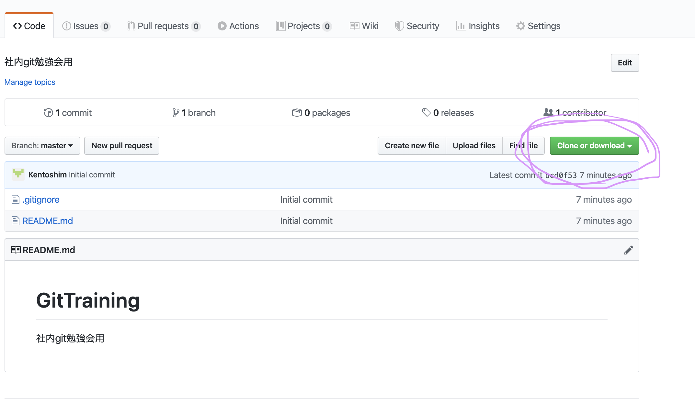
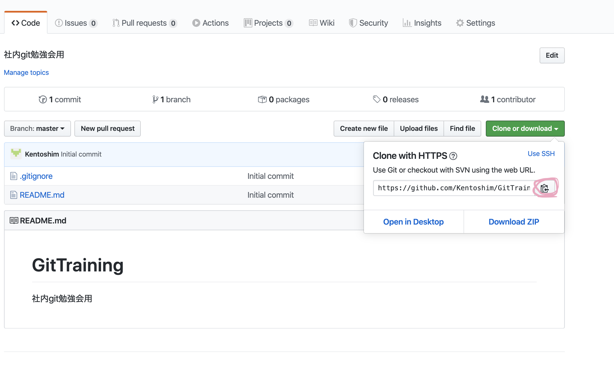
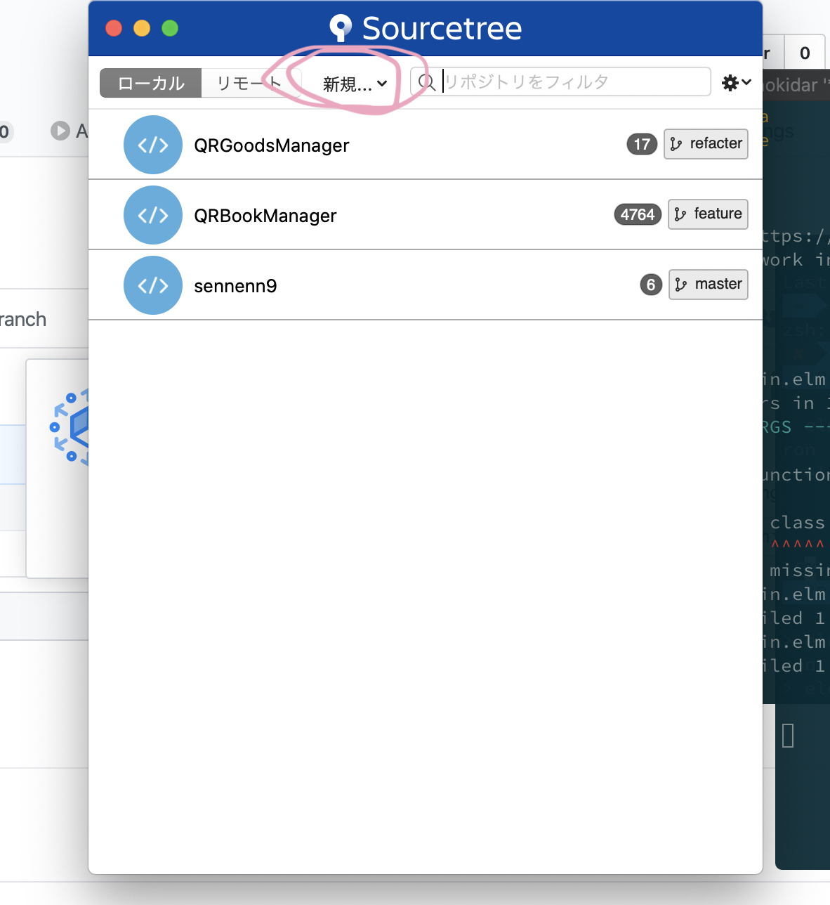

# GitTraining
社内git勉強会用
---

### まずgit clone
とりあえずやってください

このボタンを押すとURLが表示されるので

このボタンを押してクリップボードにコピー

- ターミナルの場合
  1. ターミナルでリポジトリを置きたい場所まで移動します
  2. `git clone <URL>`
  3. `ls`でディレクトリを確認します

- SourceTreeの場合
    1. SourceTree起動時の画面で新規リポジトリを選択 
    2. URLとフォルダのパスを入力してクローンを選択
    3. こんな画面になるはず

## gitとは
分散型バージョン管理システム  
  複数の作業者が行なった作業を統合したり、過去の状態に戻したりといったことができる（かなりざっくりした説明）

### ざっくり用語
#### リポジトリ
    ファイルの変更を管理する場所。
    ディレクトリをリポジトリの管理下に置くことで変更を追跡できるようになる。
    ローカルとリモートの二種類存在する

- ローカルリポジトリ
  - 作業者が自分の環境に所有しているリポジトリ
  - さっきクローンしてきて今手元にあるもの
- リモートリポジトリ
  - どこか別の場所（github AzureDevOps）に置いてあるリポジトリ
  - さっきクローンしてきた元の方

#### ブランチ
    変更履歴の流れを記録しておくもの
    基本的に他のブランチに影響を与えない（影響を受けない）ので、
    大体縦に伸びる
    並行して他の機能の開発や変更を行うことができる。

#### コミット
    確定した変更履歴、または変更を現在のブランチに保存すること
    コミットするとブランチが伸びる。

#### マージ
    別のブランチで行われていた変更を現在のブランチに取り込むこと
    しばしばコンフリクトする。

#### コンフリクト
    マージの競合
    マージする際にそれぞれのブランチで同じファイルを操作していた場合、
    gitはどっちの変更を適用するべきか判断できないので、手動で変更を取り込むか破棄するかを選択する必要がある。

### やっていく
1. ローカルブランチで作業
2. addとcommit
3. ローカルでmasterとmergeする
   - コンフリクトの対処 
4. pushする
5. プルリク作成
6. プルリク承認